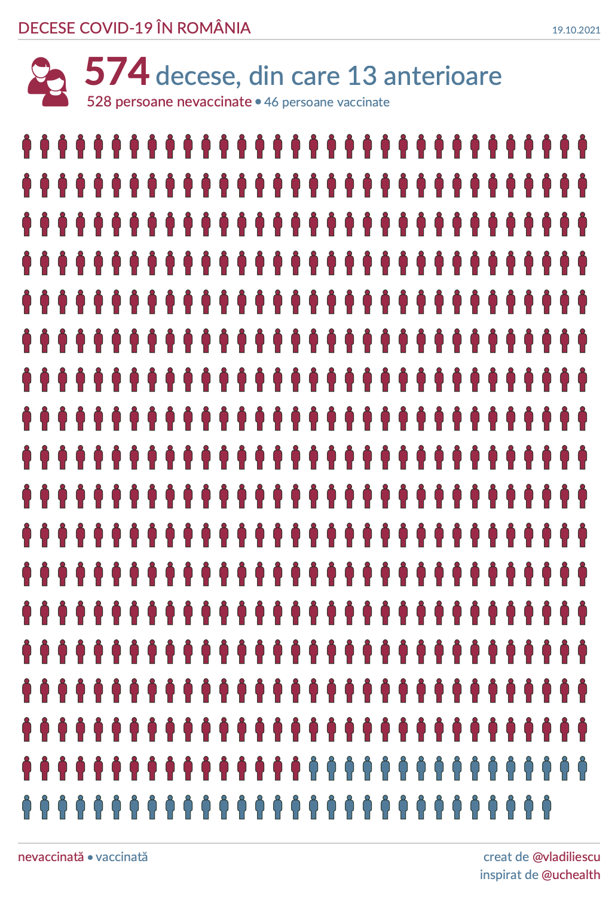

# Decese COVID

## About

A script meant to render the vaccinated/unvaccinated distribution of the daily COVID-related deaths reported in Romania.

Here's a sample output, using the [actual numbers](https://www.mai.gov.ro/informare-covid-19-grupul-de-comunicare-strategica-19-octombrie-ora-13-00-2/) for 19 October 2021.

``` sh
python render.py 528 46 13
```



## How to run

Create a virtualenv, or even better a [conda](https://docs.conda.io/en/latest/miniconda.html) env and install the dependencies from `requirements.txt`.

``` sh
conda create -n covid python=3.8 pip=20
conda activate covid
pip install -r requirements.txt
```

## How to help

Take a look at the [issues](https://github.com/vladiliescu/DeceseCOVID/labels/help%20wanted) to see if there's something you could tackle, add a comment to the one you'd like to work on.

If **development**'s not your game but **design** is, take a look at [our sample output](./sample/out.svg) and see if you can make it better. Please get in contact with @vladiliescu before doing so, to make sure no one else is working on this.

Last but not least, you can try convincing your friends to get vaccinated. Maybe show them the [Twitter account](https://twitter.com/DeceseCOVID).
